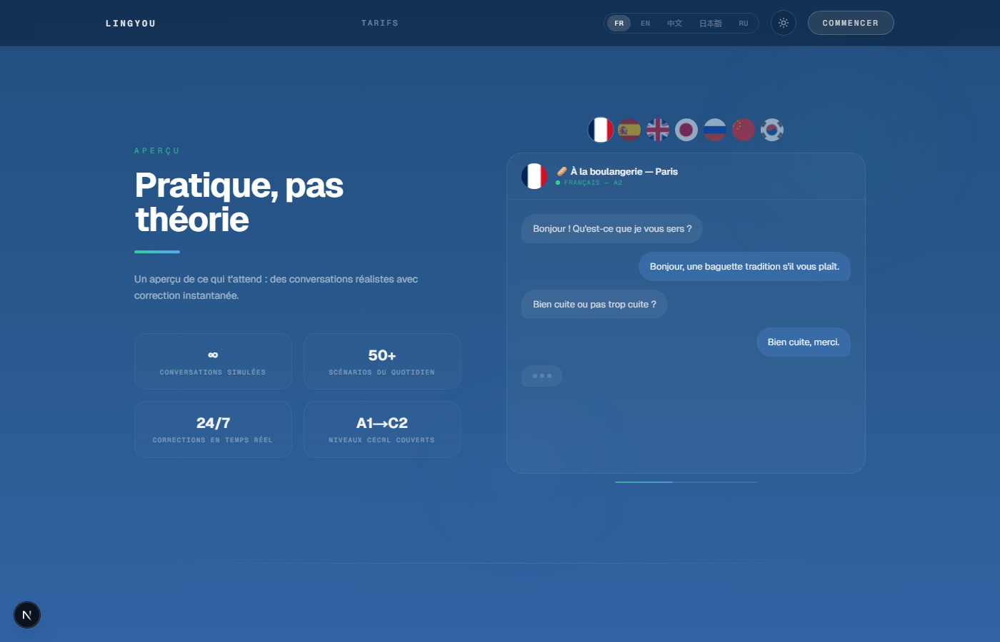
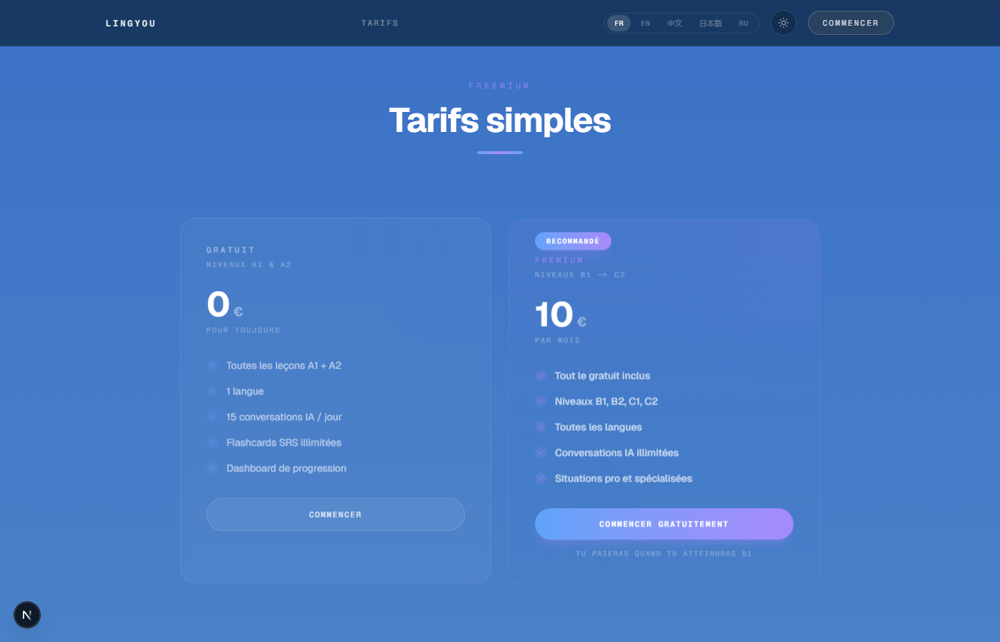
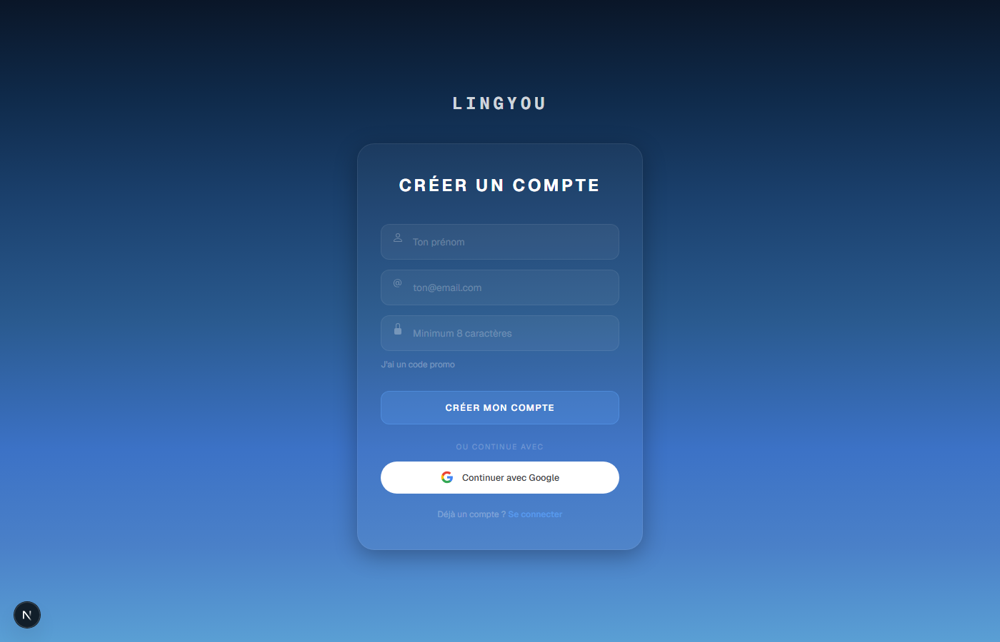
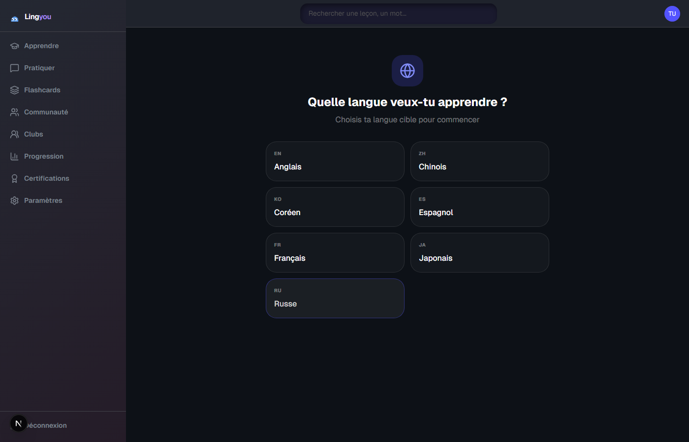
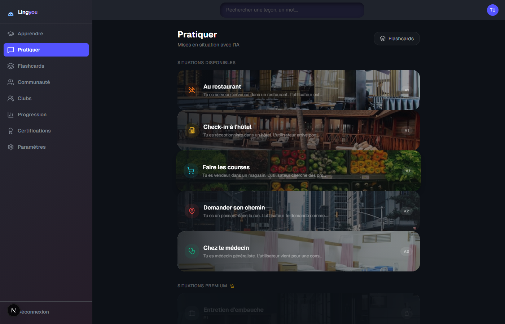
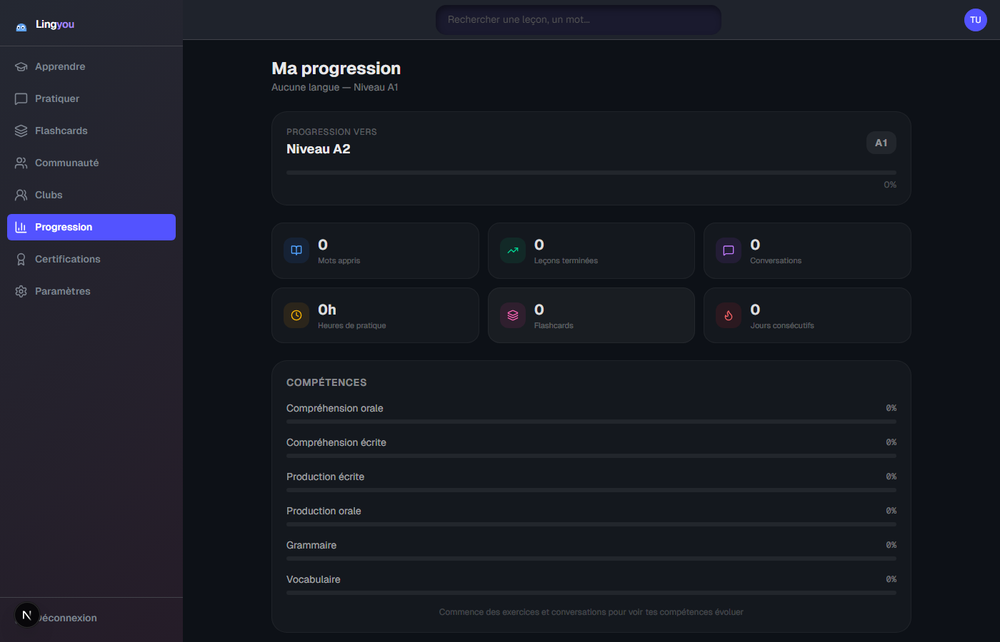

# Lingyou — Language Learning Platform

> A full-stack language learning platform built with Next.js 15, designed to teach languages through real-world immersion rather than abstract grammar drills.

**Live demo:** [linguamaster-beta.vercel.app](https://linguamaster-beta.vercel.app)

---

## Screenshots

| Landing Page | Features | Pricing |
|:---:|:---:|:---:|
|  |  |  |

| Register | Onboarding | Practice (AI Scenarios) |
|:---:|:---:|:---:|
|  |  |  |

| Progress Dashboard |
|:---:|
|  |

---

## Why this project?

Most language apps make you translate "the cat is on the table" for months without ever holding a real conversation. Lingyou takes a different approach:

- **Contextual immersion** — Learn through real situations (ordering at a restaurant, job interviews, traveling)
- **Active production from day 1** — Speaking and writing exercises, not just multiple choice
- **AI-powered conversations** — Practice with GPT-4o-mini in realistic role-play scenarios
- **Spaced repetition (SM-2+)** — Science-backed flashcard algorithm (same foundation as Anki)
- **Smart paywall** — Free A1-A2 levels to prove the method works, premium from B1+

---

## Tech Stack

| Layer | Technology |
|-------|-----------|
| **Framework** | Next.js 15 (App Router, Turbopack) |
| **Language** | TypeScript (strict mode) |
| **Styling** | Tailwind CSS 4 + shadcn/ui |
| **Auth** | NextAuth.js v5 (email + Google OAuth) |
| **Database** | PostgreSQL (Neon) + Prisma 7 ORM |
| **AI** | OpenAI GPT-4o-mini (server-side only) |
| **Payments** | Stripe (subscriptions, webhooks, promo codes) |
| **Rate Limiting** | Upstash Redis |
| **State** | Zustand (client) + TanStack Query (server) |
| **Animations** | Framer Motion |
| **Hosting** | Vercel (serverless) |

---

## Architecture

```
src/
├── app/
│   ├── (auth)/              # Login, Register
│   ├── (dashboard)/         # All authenticated pages
│   │   ├── learn/           # Structured course lessons
│   │   ├── practice/        # AI chat, flashcards
│   │   ├── progress/        # Stats & analytics
│   │   ├── clubs/           # Social learning groups
│   │   ├── community/       # User-generated content
│   │   ├── certifications/  # Timed exams & certificates
│   │   └── settings/        # User preferences, immersion mode
│   ├── (marketing)/         # Landing page, pricing
│   └── api/                 # 36 API routes
├── components/              # Reusable UI components
├── lib/
│   ├── ai/                  # OpenAI integration
│   ├── srs/                 # Spaced repetition algorithm
│   ├── auth/                # Auth configuration
│   ├── stripe/              # Payment logic
│   └── i18n/                # 9 locales (5 UI + 4 immersion)
├── hooks/                   # Custom React hooks
├── stores/                  # Zustand stores
└── types/                   # TypeScript definitions
```

---

## Database Schema

**27 models** — 534 lines of Prisma schema covering:

- **Users & Auth** — User, Account, Session, VerificationToken
- **Learning** — Language, Course, Chapter, Lesson, Exercise, UserProgress
- **Practice** — Flashcard (SRS), Conversation (AI chat), PronunciationAttempt
- **Social** — Club, ClubMember, ClubChallenge, ChallengeProgress
- **Community** — CommunityContent, ContentVote
- **Certifications** — CertificationExam, Certification
- **Billing** — Subscription, PromoCode, PromoRedemption, ProcessedWebhookEvent
- **Security** — ApiUsageLog

---

## Key Features

### Learning System
- **7 languages** supported (EN, ES, DE, JA, ZH, RU, KO)
- **Structured courses** with thematic chapters (A1 → C2 CEFR levels)
- **9 exercise types** per lesson: listening, reading, writing, fill-in-the-blank, matching, reordering, translation, contextual MCQ, free writing
- **Vocabulary auto-extraction** — exercises are generated from lesson vocabulary

### AI Conversations
- Role-play scenarios with GPT-4o-mini (restaurant, airport, job interview...)
- Server-side prompt construction — client sends a `scenarioId`, never raw prompts
- Rate limited: 15 msg/day (free), unlimited (premium)

### Spaced Repetition (SM-2+)
- Flashcards auto-generated after each lesson
- Algorithm calculates next review date based on recall quality
- Swipe UI (Tinder-style) for fast daily reviews

### Voice Recognition
- Web Speech API for pronunciation exercises
- Real-time feedback on spoken language

### Clubs & Social
- Create/join learning clubs
- Challenges with leaderboards
- Member management

### Certifications
- Timed exams per language and CEFR level
- Certificate generation on passing
- 14 pre-seeded exams (7 languages × A1/A2)

### Immersion Mode
- Switch the entire app interface to the target language
- 4 additional immersion locales (ES, DE, KO, AR)

### Security & Cost Control
- **API key never exposed client-side** — all AI calls go through API routes
- **Rate limiting** on all AI endpoints (Upstash Redis)
- **Input/output token limits** enforced server-side
- **Auth required** on all protected routes (middleware)
- **Webhook idempotency** for Stripe events
- **Zod validation** on all API inputs

---

## Business Model

| | Free (A1-A2) | Premium — 10€/month (B1+) |
|---|---|---|
| Lessons | A1 + A2 complete | All levels (B1 → C2) |
| AI conversations | 15 msg/day | Unlimited |
| Flashcards | Unlimited | Unlimited |
| Languages | 1 | All 7 |
| Certifications | A1-A2 | All levels |
| Community | Read | Create + vote |

---

## Internationalization

- **5 UI languages**: French (default), English, Chinese, Japanese, Russian
- **4 immersion-only locales**: Spanish, German, Korean, Arabic
- Client-side i18n via React Context (`useI18n()` hook)
- ~500+ translation keys per locale

---

## Getting Started

### Prerequisites
- Node.js 18+
- PostgreSQL database (or Neon free tier)
- OpenAI API key

### Setup

```bash
git clone https://github.com/Yukouf/lingora.git
cd lingora
npm install
```

Create `.env` with required variables:
```env
DATABASE_URL=          # PostgreSQL connection string (pooled)
DIRECT_URL=            # PostgreSQL direct connection
NEXTAUTH_URL=          # http://localhost:3000
NEXTAUTH_SECRET=       # openssl rand -base64 32
GOOGLE_CLIENT_ID=      # Google Cloud Console
GOOGLE_CLIENT_SECRET=  # Google Cloud Console
OPENAI_API_KEY=        # OpenAI dashboard
STRIPE_SECRET_KEY=     # Stripe dashboard
NEXT_PUBLIC_STRIPE_PUBLISHABLE_KEY=
STRIPE_WEBHOOK_SECRET=
NEXT_PUBLIC_APP_URL=   # http://localhost:3000
UPSTASH_REDIS_REST_URL=
UPSTASH_REDIS_REST_TOKEN=
```

```bash
npm run db:push        # Create database tables
npm run db:seed        # Seed with 7 languages, courses, exercises, exams
npm run dev            # Start dev server (Turbopack)
```

---

## Stats

- **170 source files**
- **36 API routes**
- **27 database models**
- **9 locales**
- **7 languages**
- **14 certification exams**
- **9 exercise types**

---

## License

MIT
